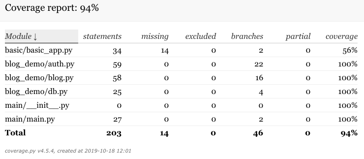

# Flask_Demo
## Environment

* Python 3.7

* Flask 1.1.1

## Running blog_demo
* Initialize Database:
```
(venv) jzongnan (master *+) Flask_Demo
$ export FLASK_APP=main/main.py
(venv) jzongnan (master *+) Flask_Demo
$ export FLASK_ENV=development
(venv) jzongnan (master *+) Flask_Demo
$ flask init-db
Initialized the database.
```
* Run blog_demo:
```
(venv) jzongnan (master *+) Flask_Demo
$ flask run
 * Serving Flask app "main/main.py" (lazy loading)
 * Environment: development
 * Debug mode: on
 * Running on http://127.0.0.1:5000/ (Press CTRL+C to quit)
 * Restarting with stat
 * Debugger is active!
 * Debugger PIN: 287-589-682
```
# Running blog_demo tests
* Install pytest and coverage first
```pip install pytest coverage```
* set environment variable PYTHONPATH as your project directory, then launch pytest
```
(venv) jzongnan (master *+) Flask_Demo
$ export PYTHONPATH=/Users/jzongnan/PycharmProjects/Flask_Demo
(venv) jzongnan (master) Flask_Demo
$ pytest
====================================================================== test session starts =======================================================================
platform darwin -- Python 3.8.0, pytest-5.2.1, py-1.8.0, pluggy-0.13.0
rootdir: /Users/jzongnan/PycharmProjects/Flask_Demo, inifile: setup.cfg, testpaths: tests
collected 24 items                                                                                                                                               

tests/test_auth.py ........                                                                                                                                [ 33%]
tests/test_blog.py ............                                                                                                                            [ 83%]
tests/test_db.py ..                                                                                                                                        [ 91%]
tests/test_factory.py ..                                                                                                                                   [100%]

======================================================================= 24 passed in 2.23s =======================================================================
```
* Show test coverage
```
(venv) jzongnan (master) Flask_Demo
$ coverage run -m pytest
====================================================================== test session starts =======================================================================
platform darwin -- Python 3.8.0, pytest-5.2.1, py-1.8.0, pluggy-0.13.0
rootdir: /Users/jzongnan/PycharmProjects/Flask_Demo, inifile: setup.cfg, testpaths: tests
collected 24 items                                                                                                                                               

tests/test_auth.py ........                                                                                                                                [ 33%]
tests/test_blog.py ............                                                                                                                            [ 83%]
tests/test_db.py ..                                                                                                                                        [ 91%]
tests/test_factory.py ..                                                                                                                                   [100%]

======================================================================= 24 passed in 2.92s =======================================================================
(venv) jzongnan (master) Flask_Demo
$ coverage report
Name                 Stmts   Miss Branch BrPart  Cover
------------------------------------------------------
basic/basic_app.py      34     14      2      0    56%
blog_demo/auth.py       59      0     22      0   100%
blog_demo/blog.py       58      0     16      0   100%
blog_demo/db.py         25      0      4      0   100%
main/__init__.py         0      0      0      0   100%
main/main.py            27      0      2      0   100%
------------------------------------------------------
TOTAL                  203     14     46      0    94%
```
* Generate test coverage details in html, then open htmlcov/index.html
```
(venv) jzongnan (master) Flask_Demo
$ coverage html
(venv) jzongnan (master) Flask_Demo
$ 
```

